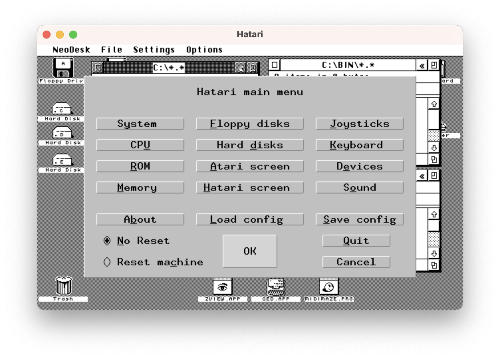
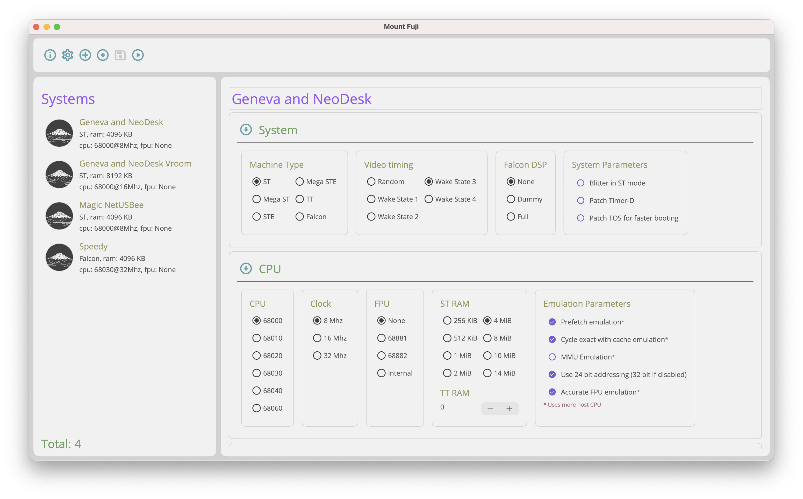

  

# Mount Fuji

Mount Fuji is a a front end for Hatari allowing you to edit different configurations for multiple 32 bit Atari machines and to execute them easily.

Fuji allow you to quickly find, see the configuration of and launch different Hatari Systems.

Fuji is open sourced under the GNU General Public license v3.0. So feel free to have at it!.

## The why?

Hatari is capable of emulating different 32 bit computers like the ST, TT and Falcon. When using Hatari it's common to have multiple config files for different systems. 

You might have a basic ST configuration for playing games: Floppy only, TOS 1.04 and just 512K of memory, perfect for maximum game compatibility.

Then again for productivity apps you might have a Mega STE running at 16MHz with a Gigabyte hard disk and 4MD of memory.

At the top end you might have a Falcon with 256 colour Videl graphics, a 68030 processor and 10MB of Memory.

And don't get me started on TTs with a gig of fast ram and a 68030 processor running at 32MHz!

Of course there's a metric crap ton of possible configurations in-between. And there in lies the rub. Managing all these configurations is not without it's problems. 

I always accrue loads of configs for different setups, rarely are they well named and I find myself hunting through them to find out what they are. Or I pick one that's named 'Gaming ST' and find out it's configured as a TT with a monochrome monitor :-)

To discover what the actual configuration of an emulated system is, involves clicking through the various Hatari config screens to see  what's what.

Mount Fuji was birthed out of my lack of organization and like any problem that a developer has, the solution wasn't, get more organized, it was write some code!

So Fuji was born and has started growing. It's certainly not finished yet, but it's at a point where I am using it most of the time for most configurations. We'll cover the gaps later.

Mount Fuji is implemented in .NET Maui a somewhat cross platform development system, at the moment I'm targeting MacOS (shown) and Windows. Windows as it stands isn't ready for release yet, but hopefully will be soon.

Unfortunately Maui does not support Linux currently, so that will remain a future goal if Microsoft get their finger out and support it. I wouldn't hold your breath for that.

## The what

You can see a video showing how Mount Fuji works and how to download and install it

## What's new 

Here's what's in the different version of Mount Fuji. See the GitHub release notes for more information and update instructions.

### Version V.Next (date TBD)

- **\#22** [_RSH_] - Modified RadioButton control template and styling to provide consistent look on supported platforms.
  - Previously themed stying on Windows was broken. Light mode and dark mode both worked when they were the OS default. However changing theme modes on windows led to problems. This is fixed now. 
- **\#24** [_RSH_] - Added a dialog buttons control to properly order OK / Cancel buttons on different platforms
  - Previously we used the Mac idiom `[Cancel] [OK]` on MacOS and Windows Now we use Now we use  `[Cancel] [OK]` on Mac and  `[OK] [Cancel]` on windows
- **\#25** [_RSH_] - Internal refactoring to reduce code complexity
  - Not visible, but needed.
- **\#24** [_DB_] Added support for keyboard configuration
  - Supports all functionality present in Hatari in a minimal way, supports setting the mapping type, specifying a mapping file etc.
  - More limited support for specifying shortcut keys (not all possible keys supported due to a limitation in Maui 8, may need to wait till Maui 9 for full Support)
  - supports importing shortcuts from a specific Hatari config file
  - there is a single global set of keyboard setting for all systems as I can't see them changing across them.

#### Contributers

- [DB] David Black: [GitHub](https://github.com/davidblackuk), [YouTube](https://www.youtube.com/channel/UC--sLs1pvHWkTxa9J-zIzAw), [Twitter](twitter.com/david_black_uk)
- [RSH] Randy S. Hunsaker [GitHub](https://github.com/hunsra)

### Version 1.0.3 (Mar 25th 2024)

This release introduced:

- A new file picker implementation
  - Added the ability to access all drives both internal and external
  - added shortcuts to your Home and documents folders.
  - moved to a three column design with devices, then folders, the files
  - Modified the folder path to be a clickable breadcrumb to allow fast file system navigation
- Added a new Rom Selector
  - Shows version info from the ROM image
  - shows the ROM language as a country flag
  - Shows the release date of the ROM
  - Loads content for the ROMs from the ROMS folder in the preferences
    - Does not allow file system navigation
    - But the original file picker is if you need to navigate
- Added a quality of life improvement, by setting Hatari's default floppy folder according to the configuration
  - The folder containing the floppy image if you specified one
  - Otherwise your Fuji Floppy folder from your preferences
- Fixed a typo where ACSi was spelled ASCI
- updated to Maui SR3, in the hopes it addressed that crashing issue in the CollectionView

There is a preview video of the [new features in this release](https://youtu.be/PhFcQSdW230?si=jqi8VCxyoWoT3Kqa)

#### Contributers

- [DB] David Black: [GitHub](https://github.com/davidblackuk), [YouTube](https://www.youtube.com/channel/UC--sLs1pvHWkTxa9J-zIzAw), [Twitter](twitter.com/david_black_uk)

### Version 1.0.2 (Feb 22nd 2024)

This was the release version of Fuji, its features are shown in the video above.

#### Contributers

- [DB] David Black: [GitHub](https://github.com/davidblackuk), [YouTube](https://www.youtube.com/channel/UC--sLs1pvHWkTxa9J-zIzAw), [Twitter](twitter.com/david_black_uk)